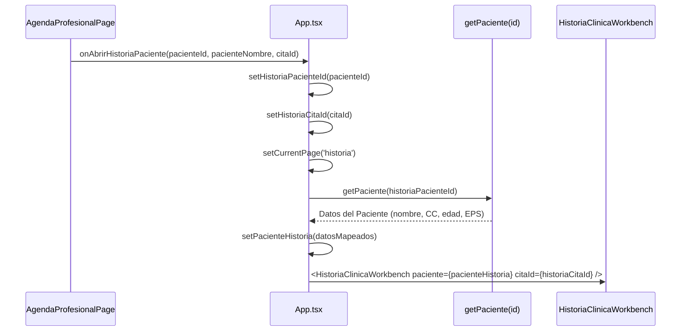

Ran command: `Get-ChildItem -Path "c:\Projects\SARAI\frontend\src\modules\historia-clinica" -Recurse | Select-Object FullName`
Ran command: `Get-ChildItem -Path "c:\Projects\SARAI\frontend\src" -Recurse -Filter "*Historia*" | Select-Object FullName`
Ran command: `Get-ChildItem -Path "c:\Projects\SARAI\frontend\src" -Recurse -Filter "*Admission*" | Select-Object FullName`
Ran command: `Get-ChildItem -Path "c:\Projects\SARAI\frontend\src" -Recurse -Filter "*Guard*" | Select-Object FullName`
Ran command: `Select-String -Path "c:\Projects\SARAI\frontend\src\**\*.ts*" -Pattern "ClinicalAdmissionGuard|VITE_ENABLE_HC_DEV_BYPASS|ADMITIDO|EN_SALA"`
Viewed registry.tsx:1-54
Viewed historiaClinica.types.ts:1-120
Viewed HistoriaClinicaWorkbench.tsx:1-800
Viewed HistoriaClinicaWorkbench.tsx:800-819
Viewed SignosVitalesModule.tsx:1-235
Viewed MotivoConsultaModule.tsx:1-46
Viewed DiagnosticosModule.tsx:1-178
Viewed HistoriaClinicaPage.tsx:1-800
Ran command: `Get-ChildItem -Path "c:\Projects\SARAI\frontend\src" -Recurse -Filter "*router*" | Select-Object FullName`
Ran command: `Get-ChildItem -Path "c:\Projects\SARAI\frontend\src" | Select-Object Name`
Viewed App.tsx:1-681
Ran command: `Select-String -Path "c:\Projects\SARAI\frontend\package.json" -Pattern "router"`
Ran command: `Get-ChildItem -Path "c:\Projects\SARAI" -Recurse -Filter "*ClinicalAdmissionGuard*" | Select-Object FullName`
Ran command: `git log -n 10 --oneline`
Ran command: `git show --stat 1a31afd2`
Viewed modulo-historia-clinica.md:1-96
Viewed usePlantillaAtencion.ts:1-48
Viewed AgendaProfesionalPage.tsx:1-120
Viewed AgendaProfesionalPage.tsx:121-250
Viewed AgendaProfesionalPage.tsx:350-450
Ran command: `Get-ChildItem -Path "c:\Projects\SARAI" -Recurse -Filter "*ClinicalAdmissionGuard*"`
Ran command: `git grep -i "BYPASS"`
Ran command: `git grep -i "admission"`
Ran command: `git grep -i "admision"`
Ran command: `Get-ChildItem -Path "c:\Projects\SARAI\frontend" -Filter ".env*"`
Viewed .env.example:1-20
Viewed HistoriaClinicaWorkbench.test.tsx:1-110
Ran command: `npm test -- src/tests/HistoriaClinicaWorkbench.test.tsx --run`
Checked task Run Workbench tests
Checked task Run Workbench tests
Checked task Run Workbench tests
Checked task Run Workbench tests
Checked task Run Workbench tests
Viewed useActiveSection.ts:1-40

# Auditoría Técnica y Estado del Arte: Módulo de Historia Clínica Electrónica (SARAI HIS)

**Rol:** Senior Frontend Software Architect (EHR / HIS Specialist)  
**Fecha de Auditoría:** Octubre 2026  
**Alcance:** `frontend/` (React 18, TypeScript, Tailwind CSS, Vite) y su articulación con `his-core` (NestJS).

---

## 1. Arquitectura y Registro de Submódulos

### 1.1 Estructura en `src/modules/historia-clinica/`
El sistema implementa un patrón **Registry + Dynamic Lazy Loader**, diseñado para desacoplar el contenedor asistencial (`HistoriaClinicaWorkbench`) de la implementación individual de cada sección clínica.

```
src/modules/historia-clinica/
├── registry.tsx
└── submodulos/
    ├── MotivoConsultaModule.tsx   ✅ Implementado
    ├── SignosVitalesModule.tsx     ✅ Implementado
    └── DiagnosticosModule.tsx      ✅ Implementado
```

### 1.2 Estado de los Submódulos del Catálogo (`SubmoduloId`)

| Submódulo ID | Componente Físico | Estado | Observación |
| :--- | :--- | :---: | :--- |
| `motivo_consulta` | `MotivoConsultaModule.tsx` | **Completado** | Captura motivo y enfermedad actual. |
| `signos_vitales` | `SignosVitalesModule.tsx` | **Completado** | Biometría completa, IMC reactivo y alertas de TA. |
| `diagnosticos` | `DiagnosticosModule.tsx` | **Completado** | CIE-10 principal tipificado + relacionados dinámicos. |
| `antecedentes` | *(Pendiente)* | ⚠️ En desarrollo | Existe en el archivo legacy `HistoriaClinicaPage.tsx`, pendiente modularizar. |
| `revision_sistemas`| *(Pendiente)* | ❌ No iniciado | Pendiente componente declarativo. |
| `examen_fisico` | *(Pendiente)* | ❌ No iniciado | Examen físico segmentario por sistemas. |
| `evolucion_nota` | *(Pendiente)* | ❌ No iniciado | Notas de evolución clínica continua (SOEP). |
| `plan_manejo` | *(Pendiente)* | ⚠️ Mock en draft | En el draft inicial existe la estructura, pero no tiene componente en el Registry. |
| `prescripcion_medica`| *(Pendiente)* | ❌ No iniciado | Fórmulas farmacológicas ambulatorias. |
| `solicitud_ayudas_diag`| *(Pendiente)*| ❌ No iniciado | Órdenes de laboratorio e imagenología. |
| `solicitud_procedimientos`| *(Pendiente)*| ❌ No iniciado | Órdenes CUPS y procedimientos quirúrgicos. |

> **Comportamiento ante submódulos no registrados:**  
> Cuando el motor de plantillas solicita un ID que no está en `REGISTRY_RAW`, el componente envoltorio `RenderSubmodulo` ejecuta un renderizado defensivo con fallback visual:
> ```tsx
> <div className="p-4 rounded-xl border border-dashed border-border text-center text-xs text-muted">
>   Submódulo <span className="font-mono text-primary">[{id}]</span> en desarrollo o pendiente en catálogo.
> </div>
> ```

### 1.3 Carga Diferida (`React.lazy` + `Suspense`) e Interfaz Común
Cada submódulo clínico debe respetar un contrato unificado definido en [`registry.tsx`](file:///C:/Projects/SARAI/frontend/src/modules/historia-clinica/registry.tsx#L5-L9):

```typescript
export interface SubmoduloProps<T = any> {
  data: T;
  onChange: (patch: Partial<T>) => void;
  readOnly?: boolean;
}
```

* **Code Splitting & Bundle Performance:** Los submódulos se importan dinámicamente con `const SignosVitalesModule = lazy(() => import('./submodulos/SignosVitalesModule'))`.
* **Suspense Fallback:** Se provee `SubmoduloFallback` con un spinner animado de `lucide-react` (`Loader2`) y estilo contextual sutil mientras el chunk JS del módulo se descarga en memoria.
* **Aislamiento de Estado:** Los submódulos no conocen al paciente, a la cita ni a la base de datos; únicamente reciben su porción de `data` y emiten mutaciones atómicas a través de `onChange(patch)`.

---

## 2. El Workbench Clínico ([`HistoriaClinicaWorkbench.tsx`](file:///C:/Projects/SARAI/frontend/src/pages/HistoriaClinicaWorkbench.tsx))

### 2.1 Resolución de Plantilla y Estado del Borrador (`DiligenciamientoDraft`)
* **Resolución de Plantilla:**  
  El componente recibe la prop `plantillaResuelta?: PlantillaResueltaResponse`. Si no se suministra, aplica como fallback [`DEFAULT_PLANTILLA_RESUELTA`](file:///C:/Projects/SARAI/frontend/src/pages/HistoriaClinicaWorkbench.tsx#L102-L158), una estructura que cumple con la Resolución 1995 de 1999 (Ministerio de Salud de Colombia), dividida en:
  1. *Anamnesis & Motivo*
  2. *Examen Físico & Signos*
  3. *Diagnóstico & Juicio*
  4. *Plan & Prescripción*
* **Ciclo de Vida del Borrador (`draft`):**
  1. Si se pasa `initialDraft`, se prioriza.
  2. De lo contrario, busca en `localStorage` bajo la clave `sarai_hc_draft_${citaId}`.
  3. Si no hay nada previo, inicializa la estructura base con valores fisiológicos estándar y diagnósticos en blanco.
  4. Cada cambio disparado por un submódulo ejecuta `handleSubmoduloChange`, el cual clona inmutablemente el draft, actualiza `ultimaActualizacion: new Date().toISOString()`, guarda sincrónicamente en `localStorage` y actualiza la bandera `isDirty: true` ("Cambios pendientes").

### 2.2 Layout de Doble Panel con Scroll Independiente
Para evitar el síndrome de fatiga por pestañas o clics continuos, el layout se estructuró como un **Viewport Fijo de Altura Completa** (`h-[calc(100vh-4.5rem)] overflow-hidden`):

1. **Header Asistencial Superior (Sticky):** Muestra el resumen del paciente (Avatar, Nombre, Documento, Edad, Sexo, EPS), el código de la plantilla activa (`HC-MED-GEN-01`), el estado del autoguardado y los botones de acción asistencial ("Guardar Borrador" y "Guardar y Finalizar Atención").
2. **Sub-sidebar Fija Izquierda (`aside w-[280px]`):**
   * Posee su propio contenedor con `overflow-y-auto`.
   * Renderiza las secciones de la plantilla activa (`sec.titulo`, icono Lucide dinámico resuelto con `resolveLucideIcon`).
   * **Indicador de Progreso Seccional:** Calcula reactivamente los submódulos diligenciados mediante `getSeccionStatus(sec)` mostrando una relación `X/Y submódulos` y un check verde cuando la sección está completa.
   * **Navegación Suave:** Integrada con el hook custom [`useActiveSection(sectionIds, 130)`](file:///C:/Projects/SARAI/frontend/src/hooks/useActiveSection.ts). Utiliza un `IntersectionObserver` con `rootMargin: -130px 0px -60% 0px` para resaltar la sección visible mientras el profesional se desplaza, y `scrollToSection(id)` con `scrollIntoView({ behavior: 'smooth' })` al hacer clic.
3. **Panel Principal Derecho (`main flex-1 overflow-y-auto`):**
   * Cascada continua de formularios con anclas `id={sec.id}` y `scroll-mt-6`.
   * Agrupa los submódulos en tarjetas delimitadas con header descriptivo, ID normativo e indicación visual de obligatoriedad `(Obligatorio)`.

### 2.3 Biometría Reactiva, Alertas y Validación de Cierre
* **Cálculo de IMC en Tiempo Real:** En [`SignosVitalesModule.tsx`](file:///C:/Projects/SARAI/frontend/src/modules/historia-clinica/submodulos/SignosVitalesModule.tsx#L23-L29), al ingresar `pesoKg` y `tallaCm`, se computa reactivamente `val = peso / (talla / 100)^2` y se clasifica según la OMS (*Bajo peso, Normal, Sobrepeso, Obesidad I, Obesidad II*). Dicho valor se sincroniza de inmediato al draft global.
* **Alertas Clínicas:** El módulo evalúa los valores de `paSistolica` y `paDiastolica`:
  * `Sistólica ≥ 140` o `Diastólica ≥ 90` ➔ 🚨 *Alerta de Posible Crisis / Hipertensión* (`danger`).
  * `Sistólica < 90` o `Diastólica < 60` ➔ ⚠️ *Alerta de Hipotensión* (`warning`).
* **Barrera de Validación Clínica (`validarHistoria`):**
  Al pulsar "Guardar y Finalizar Atención", valida que los submódulos marcados como requeridos no estén vacíos:
  * Motivo de consulta registrado.
  * Presión arterial y frecuencia cardíaca diligenciadas.
  * Diagnóstico principal con código CIE-10 asignado.
  * Plan terapéutico y conducta definida.
  Si faltan requisitos, despliega un modal bloqueante impidiendo el cierre legal de la historia clínica.

---

## 3. El Guard de Admisión Clínica (`ClinicalAdmissionGuard.tsx`)

### 3.1 Diagnóstico de Estado: Componente No Implementado
> [!IMPORTANT]
> **Hallazgo Crítico de Auditoría:**  
> El archivo `ClinicalAdmissionGuard.tsx` **no existe físicamente** en el árbol de archivos de `frontend/src/`.  
> Actualmente, la validación de estados de admisión opera de manera fragmentada en la capa de interfaz de usuario de [`AgendaProfesionalPage.tsx`](file:///C:/Projects/SARAI/frontend/src/pages/consulta-externa/AgendaProfesionalPage.tsx#L380-L390):
> 1. Una cita `CONFIRMADA` sólo puede admitirse pulsando *"Paciente Llegó"* (llama a `registrarAdmisionCita(cita.id)` pasando la cita a `EN_SALA`).
> 2. El botón *"Atender → HC"* **únicamente aparece visible** si `cita.estado === 'EN_SALA'`.

### 3.2 Brecha de Seguridad y Ausencia del Bypass de Desarrollo
* Si un usuario navega a través de atajos globales, botones del dashboard o cambia manualmente la vista a `historia` o `workbench`, **no existe ningún guard que intercepte la entrada**. El Workbench simplemente se inicializa cargando los datos del mock por defecto.
* La variable de entorno `VITE_ENABLE_HC_DEV_BYPASS` **tampoco está configurada** en `.env.example` ni en el código. El bypass funciona "por accidente" debido a que `HistoriaClinicaWorkbench` tolera que `pacienteProp` y `citaIdProp` sean `undefined`.

### 3.3 Arquitectura Propuesta para el Guard
Para cerrar esta vulnerabilidad en el ciclo asistencial, se debe crear el guard con la siguiente especificación:

```tsx
// src/components/guards/ClinicalAdmissionGuard.tsx (Propuesta Arquitectónica)
import React from 'react';
import { AlertOctagon } from 'lucide-react';

interface Props {
  citaEstado?: 'CONFIRMADA' | 'EN_SALA' | 'ATENDIDA' | 'CANCELADA';
  children: React.ReactNode;
}

export const ClinicalAdmissionGuard: React.FC<Props> = ({ citaEstado, children }) => {
  const isDevBypass = import.meta.env.VITE_ENABLE_HC_DEV_BYPASS === 'true';

  if (isDevBypass) return <>{children}</>;

  const estadosPermitidos = ['ADMITIDO', 'EN_SALA'];
  if (!citaEstado || !estadosPermitidos.includes(citaEstado)) {
    return (
      <div className="flex flex-col items-center justify-center h-full p-8 text-center bg-surface rounded-2xl border border-warning/30">
        <AlertOctagon className="w-12 h-12 text-warning mb-3" />
        <h2 className="text-lg font-bold text-primary">Atención Médica Bloqueada</h2>
        <p className="text-sm text-secondary max-w-md mt-1">
          El paciente no ha completado el proceso de admisión en sala o triaje.
          Estado actual: <span className="font-mono text-warning font-bold">{citaEstado || 'SIN_CITA'}</span>.
        </p>
      </div>
    );
  }

  return <>{children}</>;
};
```

---

## 4. Integración en el Enrutador y `App.tsx`

### 4.1 Enrutamiento: Estado Centralizado vs. Declarativo
* En la actualidad **no existe `src/routes/appRouter.tsx`**. A pesar de contar con `react-router-dom: ^6.16.0` en `package.json`, la navegación en [`App.tsx`](file:///C:/Projects/SARAI/frontend/src/App.tsx) es un **State Machine Router** controlado por `const [currentPage, setCurrentPage] = useState('dashboard')`.
* No existen rutas URL RESTful del tipo `/consulta-externa/historia` o `/consulta-externa/atencion/:citaId`.
* Si el médico recarga el navegador (`F5`), la aplicación lee un parámetro plano `?page=` o regresa al dashboard, perdiendo el contexto de la cita en memoria.

### 4.2 Flujo de Datos Actual: De la Agenda al Workbench
El puente de datos actual opera de la siguiente manera:



1. En [`AgendaProfesionalPage.tsx`](file:///C:/Projects/SARAI/frontend/src/pages/consulta-externa/AgendaProfesionalPage.tsx#L83-L87), al presionar *"Atender → HC"*, se dispara `onAbrirHistoriaPaciente(cita.pacienteId, cita.pacienteNombre, cita.id)`.
2. En [`App.tsx`](file:///C:/Projects/SARAI/frontend/src/App.tsx#L613-L620), se almacenan los identificadores en `historiaPacienteId` y `historiaCitaId`.
3. Un efecto reactivo en [`App.tsx`](file:///C:/Projects/SARAI/frontend/src/App.tsx#L337-L364) invoca `getPaciente(historiaPacienteId)`, computa la edad a partir de `fechaNacimiento` y construye el objeto `pacienteHistoria: PacienteInfo`.
4. El objeto `pacienteHistoria` y el identificador `historiaCitaId` se inyectan como props al Workbench.
5. **Punto ciego detectado:** El hook [`usePlantillaAtencion.ts`](file:///C:/Projects/SARAI/frontend/src/hooks/usePlantillaAtencion.ts) existe y apunta a `/api/v1/clinical-record/citas/${citaId}/plantilla`, pero **no está siendo consumido en `App.tsx` ni en `HistoriaClinicaWorkbench`**. En consecuencia, el Workbench continúa renderizando la plantilla mock (`DEFAULT_PLANTILLA_RESUELTA`) en lugar de la plantilla resuelta dinámicamente por el backend según la especialidad y el profesional.

---

## 5. Resumen de Pendientes y Hoja de Ruta Técnica

### 5.1 Submódulos Clínicos Restantes a Construir
Siguiendo el estándar de la Resolución 1995 de Minsalud Colombia y el catálogo de `his-core`:

1. **`AntecedentesModule.tsx`:** Extraer los antecedentes del formulario legacy: patológicos, quirúrgicos, alérgicos, farmacológicos, tóxicos, gineco-obstétricos (FUM, gestas, partos, etc.) y familiares (HTA, Diabetes, Cáncer).
2. **`ExamenFisicoModule.tsx`:** Formulario segmentario y por sistemas (signos generales, cabeza/cuello, tórax/cardiopulmonar, abdomen, extremidades, neurológico).
3. **`RevisionSistemasModule.tsx`:** Interrogatorio funcional por órganos y sentidos.
4. **`PlanManejoModule.tsx`:** Conducta médica formal, recomendaciones dietarias y días de incapacidad médica estructurada.
5. **`PrescripcionMedicaModule.tsx`:** Formulación con buscador de principios activos / marcas, posología (dosis, frecuencia, vía, duración) y generación de fórmulas médicas independientes.
6. **`SolicitudAyudasDiagModule.tsx`:** Órdenes de laboratorio e imágenes con codificación CUPS y justificación clínica.
7. **`SolicitudProcedimientosModule.tsx`:** Solicitud de intervenciones quirúrgicas o procedimientos menores.
8. **`EvolucionNotaModule.tsx`:** Entrada de notas evolutivas para pacientes en seguimiento intrahospitalario o controles seriados.

### 5.2 Deuda Técnica y Acoplamientos a Resolver

1. **Migración a React Router Declarativo (`appRouter.tsx`):**
   * Sustituir el switch `currentPage` de `App.tsx` por rutas declarativas con `react-router-dom`:
     * `/consulta-externa/agenda`
     * `/consulta-externa/atencion/:citaId`
   * Esto permitirá refrescar pantalla, habilitar historial de navegación nativo del navegador y permitir deep links desde notificaciones o admisiones.
2. **Consumo Real de `usePlantillaAtencion`:**
   * Conectar `usePlantillaAtencion(citaId)` dentro de `HistoriaClinicaWorkbench` o en su ruta contenedora para que la plantilla provenga de la jerarquía de resolución de NestJS (*Profesional Override ➔ Sede Override ➔ Institucional Default*).
3. **Persistencia Backend (`onSaveDraft` / `onFinalizarAtencion`):**
   * Conectar las funciones de guardado del Workbench con el backend para persistir el JSONB de `datosExtendidos` y cambiar el estado de la cita a `ATENDIDA` / `COMPLETADA` al finalizar la sesión.
4. **Resolución Asíncrona en Tests Unitarios (`vitest`):**
   * En [`HistoriaClinicaWorkbench.test.tsx`](file:///C:/Projects/SARAI/frontend/src/tests/HistoriaClinicaWorkbench.test.tsx), las pruebas fallan porque buscan sincrónicamente (`getByPlaceholderText`) elementos montados dentro de un `React.lazy`. Se debe actualizar a consultas asíncronas con `await findByPlaceholderText(...)`.
5. **Depreciación y Retiro de `HistoriaClinicaPage.tsx`:**
   * El archivo monolítico anterior (1047 líneas) aún reside en `src/pages/consulta-externa/`. Una vez extraídos sus campos hacia los submódulos atómicos, debe archivarse o removerse para prevenir duplicidad funcional y confusión en el equipo de desarrollo.